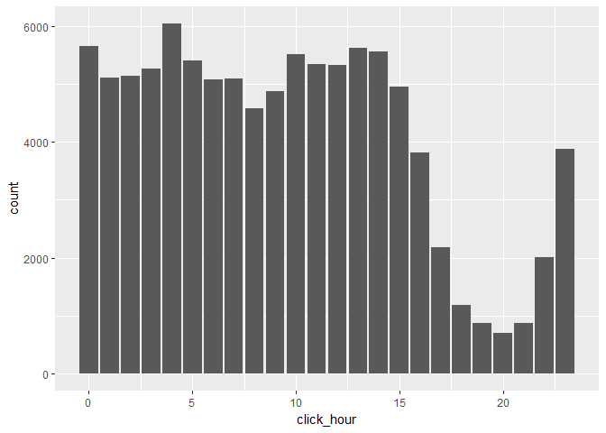
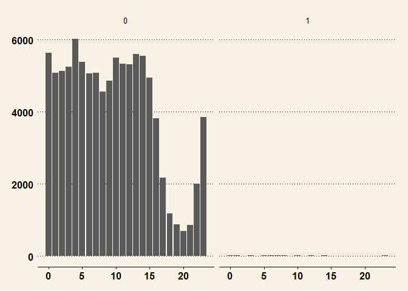

Untitled
================

Data Load
---------

fread 써보고, lubridate도 활용

``` r
library(data.table)
adt <- fread("../KTM_Lab/Data/AD_Tracking/train_sample.csv")
library(lubridate)
```

    ## 
    ## Attaching package: 'lubridate'

    ## The following objects are masked from 'package:data.table':
    ## 
    ##     hour, isoweek, mday, minute, month, quarter, second, wday,
    ##     week, yday, year

    ## The following object is masked from 'package:base':
    ## 
    ##     date

``` r
adt$click_hour <- hour(adt$click_time)
adt$click_weekd <- wday(adt$click_time)
str(adt)
```

    ## Classes 'data.table' and 'data.frame':   100000 obs. of  10 variables:
    ##  $ ip             : int  87540 105560 101424 94584 68413 93663 17059 121505 192967 143636 ...
    ##  $ app            : int  12 25 12 13 12 3 1 9 2 3 ...
    ##  $ device         : int  1 1 1 1 1 1 1 1 2 1 ...
    ##  $ os             : int  13 17 19 13 1 17 17 25 22 19 ...
    ##  $ channel        : int  497 259 212 477 178 115 135 442 364 135 ...
    ##  $ click_time     : chr  "2017-11-07 09:30:38" "2017-11-07 13:40:27" "2017-11-07 18:05:24" "2017-11-07 04:58:08" ...
    ##  $ attributed_time: chr  "" "" "" "" ...
    ##  $ is_attributed  : int  0 0 0 0 0 0 0 0 0 0 ...
    ##  $ click_hour     : int  9 13 18 4 9 1 1 10 9 12 ...
    ##  $ click_weekd    : num  3 3 3 3 5 5 5 3 4 4 ...
    ##  - attr(*, ".internal.selfref")=<externalptr>

시간대
------

``` r
library(ggplot2)
ggplot(data = adt, aes(x=click_hour)) + geom_bar()
```



테마 추가
---------

``` r
library(ggthemes)
ggplot(data = adt, aes(x=click_hour)) + geom_bar() + theme_wsj()
```


``` r
ggplot(data = adt, aes(x=click_hour)) + geom_bar() + theme_wsj() +facet_grid(.~is_attributed)
```


