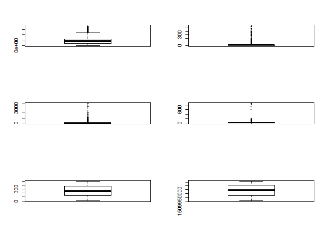

ADTracking\_Plot
================

Start
-----

``` r
adt <- read.csv("Data/AD_Tracking/train_sample.csv", stringsAsFactors = F)
head(adt)
```

    ##       ip app device os channel          click_time attributed_time
    ## 1  87540  12      1 13     497 2017-11-07 09:30:38                
    ## 2 105560  25      1 17     259 2017-11-07 13:40:27                
    ## 3 101424  12      1 19     212 2017-11-07 18:05:24                
    ## 4  94584  13      1 13     477 2017-11-07 04:58:08                
    ## 5  68413  12      1  1     178 2017-11-09 09:00:09                
    ## 6  93663   3      1 17     115 2017-11-09 01:22:13                
    ##   is_attributed
    ## 1             0
    ## 2             0
    ## 3             0
    ## 4             0
    ## 5             0
    ## 6             0

``` r
str(adt)
```

    ## 'data.frame':    100000 obs. of  8 variables:
    ##  $ ip             : int  87540 105560 101424 94584 68413 93663 17059 121505 192967 143636 ...
    ##  $ app            : int  12 25 12 13 12 3 1 9 2 3 ...
    ##  $ device         : int  1 1 1 1 1 1 1 1 2 1 ...
    ##  $ os             : int  13 17 19 13 1 17 17 25 22 19 ...
    ##  $ channel        : int  497 259 212 477 178 115 135 442 364 135 ...
    ##  $ click_time     : chr  "2017-11-07 09:30:38" "2017-11-07 13:40:27" "2017-11-07 18:05:24" "2017-11-07 04:58:08" ...
    ##  $ attributed_time: chr  "" "" "" "" ...
    ##  $ is_attributed  : int  0 0 0 0 0 0 0 0 0 0 ...

``` r
names(adt)
```

    ## [1] "ip"              "app"             "device"          "os"             
    ## [5] "channel"         "click_time"      "attributed_time" "is_attributed"

``` r
plot(adt$channel, adt$app)
```


``` r
adt$click_time <- as.POSIXct(adt$click_time)
par(mfrow=c(3,2))
boxplot(adt$ip)
boxplot(adt$app)
boxplot(adt$device)
boxplot(adt$os)
boxplot(adt$channel)
boxplot(adt$click_time)
```



``` r
par(mfrow=c(2,2))
plot(adt$app~adt$device)
plot(adt$app~adt$os)
plot(adt$app~adt$channel)
```


``` r
plot(adt[,c(2:5)])
```


``` r
adt$click_hour <- as.factor(format(adt$click_time, "%H"))
adt$click_weekd <- as.factor(format(adt$click_time, "%a"))
head(adt)
```

    ##       ip app device os channel          click_time attributed_time
    ## 1  87540  12      1 13     497 2017-11-07 09:30:38                
    ## 2 105560  25      1 17     259 2017-11-07 13:40:27                
    ## 3 101424  12      1 19     212 2017-11-07 18:05:24                
    ## 4  94584  13      1 13     477 2017-11-07 04:58:08                
    ## 5  68413  12      1  1     178 2017-11-09 09:00:09                
    ## 6  93663   3      1 17     115 2017-11-09 01:22:13                
    ##   is_attributed click_hour click_weekd
    ## 1             0         09          화
    ## 2             0         13          화
    ## 3             0         18          화
    ## 4             0         04          화
    ## 5             0         09          목
    ## 6             0         01          목

``` r
par(mfrow=c(1,2))
barplot(table(adt$click_hour))
barplot(table(adt$click_weekd))
```


